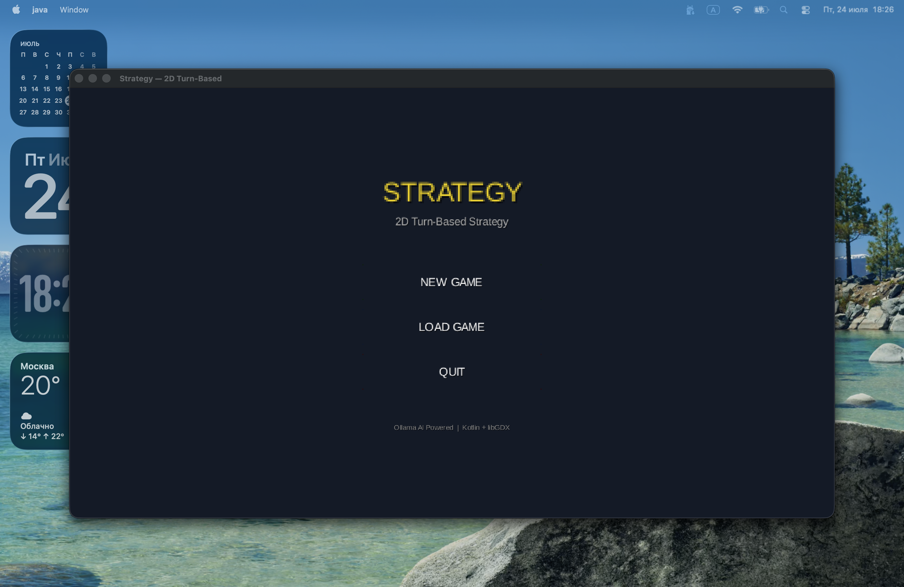
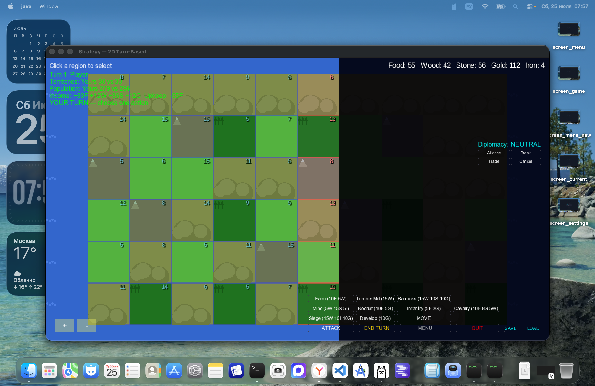
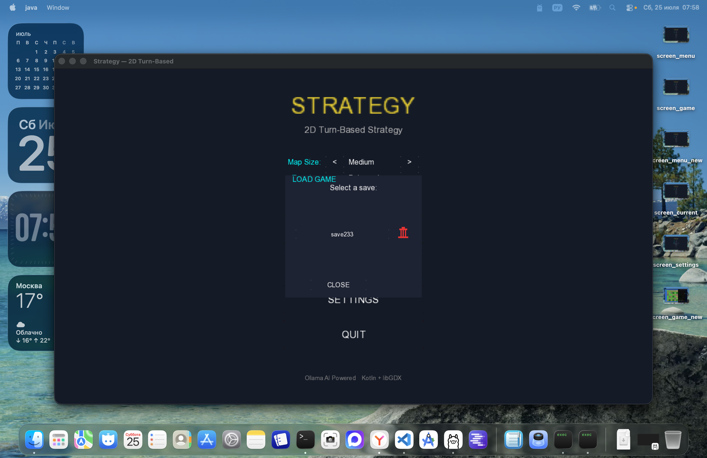
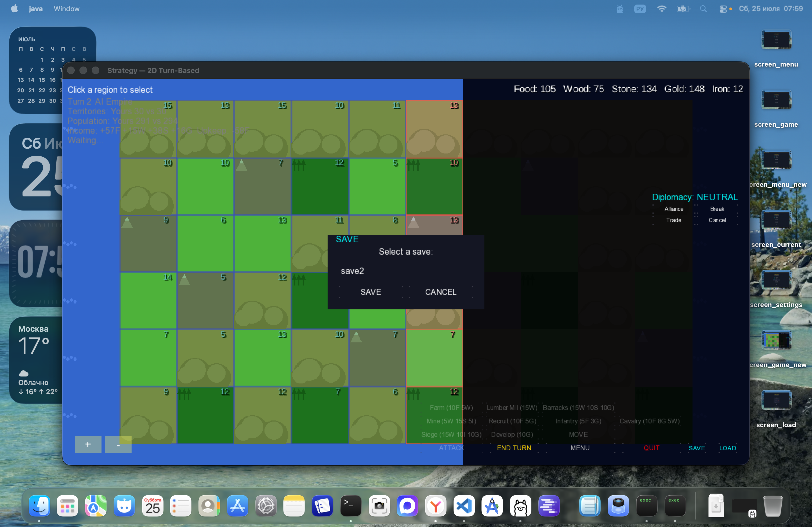

# Strategy — 2D Turn-Based Strategy Game

## Description

A prototype of a turn-based 2D strategy game inspired by "Imperialism 2" game, built on **libGDX + Kotlin + Kotlin Multiplatform**. Runs on macOS in Desktop mode. Supports **3 languages**: English, Russian, German.

## Screenshots

### Main Menu


### Settings


### Game


### Load Dialog


### Save Dialog


## Technologies

- **Kotlin 2.0.21** + Kotlin Multiplatform
- **libGDX 1.12.1** — rendering, input, UI, FreeType fonts
- **kotlinx.serialization** — JSON serialization
- **Ollama** — local AI server for opponent intelligence
- **LM Studio** — alternative local AI server (OpenAI-compatible API)
- **DeepSeek R1 (7B)** — reasoning model used for AI decision making

## Features

- **Hex-free grid map** with terrain types: Plains, Forest, Hills, Mountain, Water
- **Unit types**: Infantry, Cavalry, Siege — visualized on the map with icons
- **Buildings**: Farm, Lumber Mill, Barracks, Mine, Wall — each provides bonuses
- **Save/Load system**: Named saves with dialog UI, delete with confirmation
- **Box selection**: Click-drag to select multiple regions at once
- **Localization**: English, Russian, German — switchable from Settings
- **AI opponent**: Uses Ollama (DeepSeek R1) with automatic fallback to rule-based AI
- **Turn-based combat**: Attack, defend, recruit units, develop territories
- **Diplomacy**: Alliance, trade routes with enemy
- **Technology tree**: Agriculture, Iron Working, Masonry, Fortification, Horseback, Siege Engineering
- **Asynchronous AI**: AI turns run in background thread — no UI freezes

## Project Structure

```
Strategy/
├── common/                          # Pure Kotlin logic
│   └── src/commonMain/kotlin/com/example/strategy/
│       ├── model/
│       │   ├── Region.kt            # Region, buildings, terrain types
│       │   ├── GameMap.kt           # Map, neighbor lookup
│       │   ├── Player.kt            # Player, resources
│       │   ├── Resources.kt         # Resource types, arithmetic
│       │   ├── Unit.kt              # Unit types, combat stats
│       │   ├── Diplomacy.kt         # Diplomacy state
│       │   ├── TechTree.kt          # Technology tree
│       │   └── GameState.kt         # Top-level state
│       ├── logic/
│       │   ├── Economy.kt           # Income/upkeep calculations
│       │   ├── ActionQueue.kt       # Action queue
│       │   ├── GameRules.kt         # Build, recruit, attack, move
│       │   ├── TurnManager.kt       # Turn flow
│       │   ├── DiplomacyManager.kt  # Diplomacy actions
│       │   └── RandomEvents.kt      # Random events per turn
│       ├── pathfinding/
│       │   └── AStar.kt             # Pure Kotlin A*
│       ├── ai/
│       │   ├── OllamaAI.kt          # AI engine (Ollama + LM Studio)
│       │   └── AISettings.kt        # AI backend configuration
│       └── platform/
│           ├── Platform.kt          # Platform abstraction
│           ├── HttpClient.kt        # HTTP interface
│           └── GameFactory.kt       # World generation
└── desktop/                         # libGDX Desktop
    ├── build.gradle.kts
    └── src/main/kotlin/com/example/strategy/desktop/
        ├── DesktopLauncher.kt       # Entry point + crash logging
        ├── StrategyGame.kt          # Game class
        ├── GameScreen.kt            # Main game screen + UI
        ├── MenuScreen.kt            # Main menu + settings
        ├── Locale.kt                # Localization (EN/RU/DE)
        ├── SaveManager.kt           # Named save/load system
        ├── AnimationManager.kt      # Attack/move animations
        ├── SoundManager.kt          # Procedural sound effects

        ├── MiniMap.kt               # Minimap rendering
        └── TilesetGenerator.kt      # Runtime tileset generation
```

## Game Mechanics

| Mechanic | Description |
|----------|-------------|
| **Resources** | Food, Wood, Stone, Iron, Gold — harvested from territories |
| **Units** | Infantry (ATK 1/DEF 1), Cavalry (ATK 2/DEF 1), Siege (ATK 3/DEF 0) |
| **Building** | Farm, Lumber Mill, Barracks, Mine, Market, Wall |
| **Recruiting** | Infantry: 5F+3G, Cavalry: 10F+8G+5W, Siege: 15W+10I+10G (requires Barracks) |
| **Development** | +3 population for 10G |
| **Attack** | Attack strength = population + unit attack. Defense = population + unit defense + Wall bonus |
| **Move** | Transfer half of troops between your regions |
| **Economy** | Territory income minus upkeep (population/5 food) |
| **Turns** | Players alternate, AI runs asynchronously in background |
| **Ollama AI** | DeepSeek R1 analyzes game state and makes decisions |
| **Diplomacy** | Alliance, trade routes, break alliance |
| **Technology** | 6 tech tree items with prerequisites |

## Resources by Terrain

| Terrain | Food | Wood | Stone | Iron | Gold |
|---------|------|------|-------|------|------|
| Plains | +3 | 0 | 0 | 0 | pop/10 |
| Forest | +1 | +3 | 0 | 0 | pop/10 |
| Hills | +2 | 0 | +2 | 0 | pop/10 |
| Mountain | +1 | 0 | +2 | +1 | pop/10 |

## Buildings

| Building | Cost | Bonus |
|----------|------|-------|
| Farm | 10F + 5W | +2 Food/turn |
| Lumber Mill | 15W + 5G | +2 Wood/turn |
| Barracks | 15W + 10S + 10G | Enables recruiting |
| Mine | 5W + 15S + 5I | +2 Iron/turn |
| Market | 10W + 5S + 15G | +3 Gold/turn |
| Wall | 20S + 5I | +5 Defense per wall |

## Controls

| Action | How |
|--------|-----|
| Select region | Left-click on map |
| Select multiple regions | Left-click + drag (box selection) |
| Pan camera | Right-click + drag |
| Zoom | Scroll wheel |
| Build | Select region → action button |
| Recruit | Select region with Barracks → RECRUIT button |
| Attack | Select your region → ATTACK → click enemy region |
| Move troops | Select your region → MOVE → click your other region |
| End turn | END TURN |
| Save game | SAVE → enter name → SAVE |
| Load game | LOAD → select save from list |

## Localization

Open **SETTINGS** in the main menu to switch between:
- English (EN)
- Русский (RU)
- Deutsch (DE)

Language preference is saved automatically.

## AI

The game supports **3 AI backends** — select in **SETTINGS**:

### None (Fallback)
Rule-based AI, no external dependencies required. Works immediately.

### Ollama
Local AI server running deepseek-r1:7b.

**Setup:**
1. Install Ollama: `curl -fsSL https://ollama.ai/install.sh | sh`
2. Pull model: `ollama pull deepseek-r1:7b`
3. Start Ollama: `ollama serve`

### LM Studio
Alternative local AI server with OpenAI-compatible API.

**Setup:**
1. Download and install [LM Studio](https://lmstudio.ai)
2. Load a model (e.g., DeepSeek, Llama, Mistral)
3. Start the local server (default: `http://localhost:1234`)
4. Set URL and model name in **SETTINGS**

### How it works

When you press **END TURN**:
1. Your pending action (build/recruit/attack/move) is applied to the game state
2. Turn switches to the AI player
3. `TurnManager.startTurn()` applies income, upkeep, fog of war, and random events for the AI
4. `OllamaAI.decide()` is called in a **background thread** (non-blocking):
   - Checks `AISettings.backend` to determine which AI engine to use
   - Formats a prompt with AI's resources, territories, enemy positions, diplomacy status
   - **Ollama**: sends HTTP POST to `{url}/api/generate`
   - **LM Studio**: sends HTTP POST to `{url}/v1/chat/completions` (OpenAI-compatible format)
   - Model analyzes the situation and returns one action (e.g., `BUILD_FARM:3`, `RECRUIT:7`)
5. The AI action is dispatched back to the GL thread via `Gdx.app.postRunnable`
6. `applyAIAction()` executes the action, then `TurnManager.endTurn()` switches back to the player
7. If the AI response takes too long or the server is unreachable, **fallback AI** runs immediately (rule-based, no HTTP needed)

### Fallback (No Server Required)

**The game works fully without Ollama or LM Studio.** If the selected backend is unavailable, the AI uses a rule-based strategy:

1. Build Barracks if near enemy and can afford
2. Build Walls if has Barracks and near enemy
3. Build Farm on empty territories (if can afford)
4. Build Mine on mountains (if can afford)
5. Recruit troops if Barracks exist (if can afford)
6. Develop regions if Gold is available (if can afford)
7. Propose trade if neutral and wealthy

## Game Guides

- [English](HOW_TO_PLAY_EN.md)
- [Русский](HOW_TO_PLAY_RU.md)
- [Deutsch](HOW_TO_PLAY_DE.md)

## Known Issues

- Ollama/LM Studio calls may briefly freeze the UI if the server is slow to respond (reduced by async AI, but timeout can still cause brief pauses)

## Changelog

### v0.2.0 (July 2026)
- AI backend selection: Ollama, LM Studio, or Fallback
- Localization: English, Russian, German
- Unit icons on map (Infantry, Cavalry, Siege)
- Box selection for multiple regions
- Named save/load with delete confirmation
- Zoom buttons (+/-) with scroll wheel hint
- Tutorial hint on first game start
- Crash logging to file
- GitHub Actions CI
- Game guides in 3 languages

### v0.1.0 (July 2026)
- Initial release with core gameplay
- Ollama AI with fallback strategy
- Diplomacy, tech tree, fog of war
- Animations, sounds, minimap
- Map configuration, difficulty levels

## Running

```bash
export JAVA_HOME=/opt/homebrew/opt/openjdk@17
./gradlew desktop:run
```

## Last Updated

July 2026
