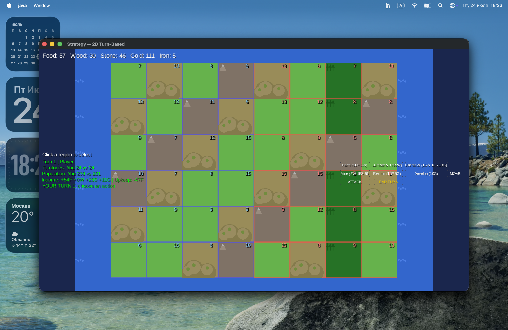

# Strategy — 2D Turn-Based Strategy Game

## Description

A prototype of a turn-based 2D strategy game inspired by "Imperialism 2" game, built on **libGDX + Kotlin + Kotlin Multiplatform**. Runs on macOS in Desktop mode.

## Screenshots

### Main Menu


### Game



## Technologies

- **Kotlin 2.0.21** + Kotlin Multiplatform
- **libGDX 1.12.1** — rendering, input, UI
- **kotlinx.serialization** — JSON serialization
- **Ollama (deepseek-r1:7b)** — AI opponent

## Project Structure

```
Strategy/
├── common/                          # Pure Kotlin logic
│   └── src/commonMain/kotlin/com/example/strategy/
│       ├── model/
│       │   ├── Region.kt            # Region, buildings, terrain types
│       │   ├── GameMap.kt           # Map, neighbor lookup
│       │   ├── Player.kt            # Player, resources
│       │   ├── Resources.kt         # Resource types, arithmetic
│       │   └── GameState.kt         # Top-level state
│       ├── logic/
│       │   ├── Economy.kt           # Income/upkeep calculations
│       │   ├── ActionQueue.kt       # Action queue
│       │   ├── GameRules.kt         # Build, recruit, attack, move
│       │   └── TurnManager.kt       # Turn flow
│       ├── pathfinding/
│       │   └── AStar.kt             # Pure Kotlin A*
│       ├── ai/
│       │   └── OllamaAI.kt          # Ollama integration
│       ├── serialization/
│       │   └── GameStateSerializer.kt
│       └── platform/
│           ├── Platform.kt          # Platform abstraction
│           ├── HttpClient.kt        # HTTP interface
│           └── GameFactory.kt       # World generation
└── desktop/                         # libGDX Desktop
    ├── build.gradle.kts
    └── src/main/kotlin/com/example/strategy/desktop/
        ├── DesktopLauncher.kt       # Entry point
        ├── StrategyGame.kt          # Game class
        ├── GameScreen.kt            # Main screen + UI
        ├── DesktopPlatform.kt       # Platform implementation
        ├── DesktopHttpClient.kt     # HTTP implementation
        └── ui/
            └── ActionPanel.kt       # Action panel
```

## Game Mechanics

| Mechanic | Description |
|----------|-------------|
| **Resources** | Food, Wood, Stone, Iron, Gold — harvested from territories |
| **Building** | Farm, Lumber Mill, Barracks, Mine — each provides bonuses |
| **Recruiting** | +5 population for 10F + 5G (requires Barracks) |
| **Development** | +3 population for 10G |
| **Attack** | Capture enemy territories using population |
| **Move** | Transfer troops between your regions |
| **Economy** | Territory income minus upkeep (population/5 food) |
| **Turns** | Players alternate, AI auto-skips its turn |
| **Ollama AI** | DeepSeek R1 analyzes game state and makes decisions |

## Resources by Terrain

| Terrain | Food | Wood | Stone | Iron | Gold |
|---------|------|------|-------|------|------|
| Plains | +3 | 0 | 0 | 0 | pop/10 |
| Forest | +1 | +3 | 0 | 0 | pop/10 |
| Hills | +2 | 0 | +2 | 0 | pop/10 |
| Mountain | +1 | 0 | +2 | +1 | pop/10 |

## Buildings

| Building | Cost | Bonus |
|----------|------|-------|
| Farm | 10F + 5W | +2 Food/turn |
| Lumber Mill | 15W + 5G | +2 Wood/turn |
| Barracks | 15W + 10S + 10G | Enables recruiting |
| Mine | 5W + 15S + 5I | +2 Iron/turn |

## Attack Rules

- Attack strength = attacker region population
- Defense strength = defender population + 5 per Wall
- On victory: territory captured, attacker loses half troops
- On defeat: attacker loses 2/3 troops

## AI (Ollama)

### Setup

1. Install Ollama: `curl -fsSL https://ollama.ai/install.sh | sh`
2. Pull model: `ollama pull deepseek-r1:7b`
3. Start Ollama: `ollama serve`

### How it works

When you press **END TURN**:
1. AI receives current game state (resources, territories, enemies)
2. Sends prompt to Ollama (`deepseek-r1:7b`)
3. Model analyzes the situation and picks one action
4. Action is executed, turn returns to the player

### Fallback

If Ollama is unavailable, a default strategy runs:
- Build Farm on empty territories
- Recruit troops if Barracks exist
- Develop regions if Gold is available

## Controls

| Action | How |
|--------|-----|
| Select region | Left-click on map |
| Pan camera | Right-click + drag |
| Zoom | Scroll wheel |
| Build | Select region → action button |
| Attack | Select your region → ATTACK → click enemy |
| Move troops | Select your region → MOVE → click your other region |
| End turn | END TURN |

## Running

```bash
export JAVA_HOME=/opt/homebrew/opt/openjdk@17
./gradlew desktop:run
```

## Last Updated

July 2026
